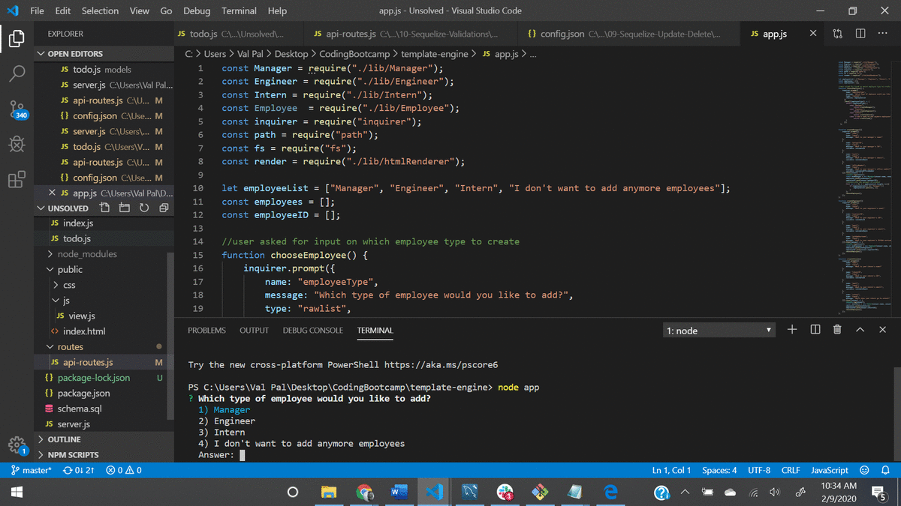

# template-engine

## Description 

This project was created to generate an engineering team using a CLI. Unique data is gathered about each team member (manager, engineer, 
and/or intern) and then an HTML page is dynamically generated based on the information gathered.

The biggest challenge I faced was figuring out how to generate each team member and then regather that information to be put into an HTML page.
I eventually created an array to pass the information to render the team page.  Future edits to this program could be to add additional employee
options and further employee information.  

## Installation

To utilize the project install inquirer (and jest if you would like to run tests)

## Usage 

Create an engineering team using a command line application. Once all the information is gathered an HTML page is created that showcases
all of the teams information.

## Credits

## Demo

## License

MIT License

Copyright (c) 2020 Valerie Riley

Permission is hereby granted, free of charge, to any person obtaining a copy
of this software and associated documentation files (the "Software"), to deal
in the Software without restriction, including without limitation the rights
to use, copy, modify, merge, publish, distribute, sublicense, and/or sell
copies of the Software, and to permit persons to whom the Software is
furnished to do so, subject to the following conditions:

The above copyright notice and this permission notice shall be included in all
copies or substantial portions of the Software.

THE SOFTWARE IS PROVIDED "AS IS", WITHOUT WARRANTY OF ANY KIND, EXPRESS OR
IMPLIED, INCLUDING BUT NOT LIMITED TO THE WARRANTIES OF MERCHANTABILITY,
FITNESS FOR A PARTICULAR PURPOSE AND NONINFRINGEMENT. IN NO EVENT SHALL THE
AUTHORS OR COPYRIGHT HOLDERS BE LIABLE FOR ANY CLAIM, DAMAGES OR OTHER
LIABILITY, WHETHER IN AN ACTION OF CONTRACT, TORT OR OTHERWISE, ARISING FROM,
OUT OF OR IN CONNECTION WITH THE SOFTWARE OR THE USE OR OTHER DEALINGS IN THE
SOFTWARE.

